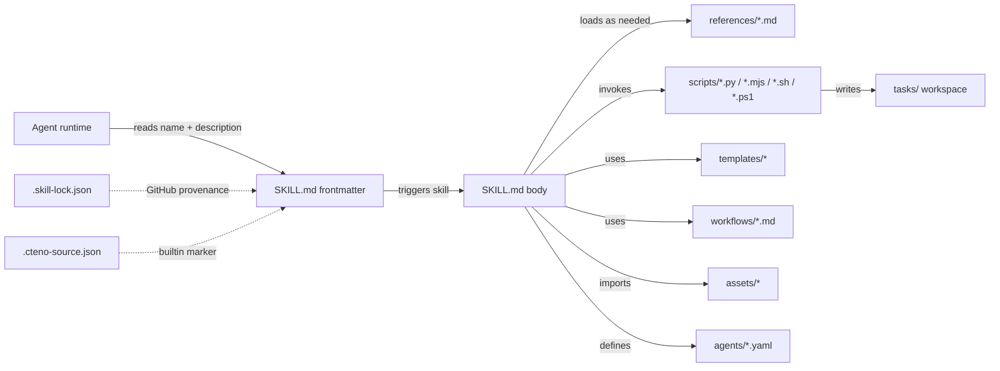

# Repository Guidelines

This repository is a curated, **user-level** collection of [agent skills](https://agentskills.io) — self-contained capability packages (`prompt + scripts + references + assets`) that downstream agents discover by `name` and load progressively. It is **framework-agnostic**: any runtime that reads `name`+`description` from the YAML frontmatter, loads `SKILL.md` body on trigger, and pulls `references/` / `scripts/` / `templates/` / `assets/` on demand can consume these skills. A small subset is platform-specific (e.g. `create-extension` for OpenCowork, `create-gsd-extension` for GSD, `sap-extension-creator` for Super Agent Party, `nuxt-ui`, `playwright-dev`) — those are flagged in their own `SKILL.md`.

- **Remote**: `git@github.com:pelioo/.agents.git` (default `main`)
- **Authoritative authoring guide**: `skills/skill-creator/SKILL.md` — read this end-to-end before adding a skill.
- **Schema enforcer (concrete)**: `skills/skill-creator/scripts/quick_validate.py` — the hard whitelist lives here, not in prose docs.

---

## Project Overview

- **Purpose**: Distribute, version, and validate agent skills that downstream agents invoke by `name`.
- **Scale**: 87 skills under `skills/` (grows over time; see `ls -d skills/*/`).
- **Source mix**: Locally authored + pulled from upstream (`tavily-ai/skills`, `vercel-labs/skills`, `jimliu/baoyu-skills`, `vikiboss/60s-skills`). Provenance tracked in `.skill-lock.json` and per-skill `.cteno-source.json`.
- **Domain**: User-level skill library. The `.skill-lock.json` `lastSelectedAgents` field lists runtimes that have been observed installing from this repo (`amp`, `cline`, `codex`, `cursor`, `gemini-cli`, `github-copilot`, `kimi-cli`, `opencode`) — informational, not a domain restriction.

---

## Architecture & Data Flow



**Three-level progressive disclosure** (per `skills/skill-creator/SKILL.md:114-124`):

1. **Metadata** — `name` + `description` always in context (~100 words).
2. **Body** — `SKILL.md` markdown, loaded when skill triggers (<5k words / **<500 lines** budget).
3. **Bundled resources** — `references/`, `scripts/`, `templates/`, `workflows/`, `assets/`, `agents/` loaded on demand. Scripts may execute without entering context.

**Two-tier skill registry**:

| Registry | Scope | Schema |
|---|---|---|
| `.skill-lock.json` (root, v3) | GitHub-sourced installs (e.g. `search`, `find-skills`, `weather-query`, `baoyu-translate`) | `{version, skills{source, sourceType, sourceUrl, skillPath, skillFolderHash, installedAt, updatedAt}, dismissed{}, lastSelectedAgents[]}` |
| `skills/<name>/.cteno-source.json` (per-skill) | Builtin/plugin-sourced skills (`a2ui`, `pptx`, `xlsx`, `browser-automation`) | `{installedAt, sourceKey, sourceType: "builtin"}` |

Both are tool-managed; never hand-edit.

---

## Key Directories

| Path | Purpose |
|---|---|
| `skills/<name>/SKILL.md` | **Required entry**. YAML frontmatter + Markdown body. The single file the runtime reads first. |
| `skills/<name>/references/` | Long-form docs loaded on demand. Keep one level deep from `SKILL.md`. |
| `skills/<name>/scripts/` | Executable helpers — Python-dominant, also Node (`.mjs`/`.js`), shell (`.sh`/`.ps1`/`.bat`), rare TypeScript. |
| `skills/<name>/templates/` | Output scaffolds the agent fills in (YAML workflow defs, Markdown routers, JSON declarative UI). |
| `skills/<name>/workflows/` | Multi-step procedure docs (Markdown) guiding the agent through complex tasks. |
| `skills/<name>/assets/` | Files copied into output (boilerplate projects, icons, fonts). **Not** loaded into context. |
| `skills/<name>/agents/` | Rare. Sub-agent definitions (`product-design`, `project-analysis`). |
| `skills/<name>/tests/` | Rare. Stdlib `unittest` per-skill unit tests (see `a2ui/tests/`, `weather-query/tests/`). |
| `.skill-lock.json` | Tool-managed registry. GitHub-sourced skills + `lastSelectedAgents`. |
| `skills/*/.cteno-source.json` | Tool-managed per-skill marker for builtin installs. |
| `tasks/` | Throwaway agent-run workspace. Contents gitignored; **never commit** generated artifacts here. |
| `.bitfun/` | IDE cache (e.g. flashgrep index). Gitignored. |

**Local override** — `skills/product-design/templates/prototype/AGENTS.md` mandates that prototype work must self-serve the dev server (run it, open it in the OpenCowork browser) instead of instructing the user to do so. Treat this as an active rule, not a hint — same authority as anything in `AGENTS.md`.

**Current subdir usage** (87 skills total; counts drift — regenerate with `for d in references scripts templates workflows assets agents tests; do printf "%-12s %d\n" "$d" "$(ls -d skills/*/$d 2>/dev/null | wc -l)"; done`):

| Subdir | # skills | Examples |
|---|---|---|
| `references/` | 22 | `a2ui`, `create-gsd-extension`, `create-mcp-server`, `create-workflow`, `weather-query` |
| `scripts/` | 28 | `skill-creator`, `create-extension`, `product-design`, `pdf`, `a2ui` |
| `templates/` | 6 | `a2ui`, `create-workflow`, `create-skill`, `planning-with-files`, `create-plan`, `docx` |
| `workflows/` | 3 | `create-skill` (9 workflows), `create-gsd-extension` (3), `create-workflow` (1) |
| `assets/` | 3 | `sap-extension-creator`, `model-thinking`, `article-to-blog` |
| `agents/` | 2 | `product-design`, `project-analysis` |
| `tests/` | 2 | `a2ui`, `weather-query` |

---

## Development Commands

The canonical validation/distribution surface (no project-wide build/test runner):

```bash
# Online schema validation (fetches skills-ref via npx)
npx -y skills-ref validate <path>      # single skill dir, e.g. skills/foo
npx -y skills-ref validate skills      # whole tree
npx -y skills-ref build <path>         # package as <name>.skill zip
npx -y skills-ref list                 # inventory + lock state
```

Offline Python validation (no network):

```bash
python3 skills/skill-creator/scripts/quick_validate.py <skill-dir>     # frontmatter schema only
python3 skills/skill-creator/scripts/package_skill.py <skill-dir> [out-dir]   # validate + zip
python3 skills/skill-creator/scripts/init_skill.py <name> --path <out-dir>   # scaffold new skill
```

Per-skill bundled scripts worth knowing:

```bash
# Create OpenCowork V1 extension (minimal / http / ui template)
python3 skills/create-extension/scripts/create_extension.py <id> --path <dir> --template {minimal|http|ui} [--validate-only]

# Bootstrap product-design Vite + React 19 prototype
node skills/product-design/scripts/bootstrap-prototype.mjs --dest <abs-path>

# Per-skill unit tests (when present)
python -m unittest skills/a2ui/tests/test_render.py
python -m unittest discover -s skills/weather-query/tests
```

Smoke-test pattern (from `skills/create-skill/workflows/verify-skill.md:81`):

```bash
{tool-name} --help | grep "{documented-flag}"
```

---

## Code Conventions & Common Patterns

### SKILL.md frontmatter — authoritative schema

The **hard whitelist** is enforced by `skills/skill-creator/scripts/quick_validate.py:42`:

```yaml
---
name: my-skill              # required. ^[a-z0-9-]+$, ≤64 chars, no leading/trailing/consecutive hyphens
description: Does X. Use when user asks for Y or mentions Z.   # required. ≤1024 chars, no < or >
license: MIT                # optional
allowed-tools: Bash(...)    # optional. Comma-separated tool scopes
metadata: {}                # optional. Free-form object
---
```

> **Frontmatter whitelist is strict — only 5 keys accepted.** `skills/skill-creator/SKILL.md:314` (the authoritative authoring guide) states: *"Do not include any other fields in YAML frontmatter."* `quick_validate.py:42` enforces the whitelist `{name, description, license, allowed-tools, metadata}` and rejects everything else. `README.md:268-278` (the Chinese companion doc) erroneously lists additional optional keys (`compatibility`, `version`, `slug`, `homepage`, `changelog`, `authors`, `credentials`, `tags`); README is **wrong**, the validator is the source of truth.
>
> Some existing skills in the repo carry non-spec keys (`version`, `author`, `tags`, `homepage`, `changelog`, `user-invocable`, `risk`, `source`, `date_added`, `official`, `compatibility`, `authors`) because `package_skill.py` does not re-run `quick_validate` for extras. These are **violations to fix, not patterns to copy**. Before opening a PR: run `python3 skills/skill-creator/scripts/quick_validate.py skills/<name>` and remove any unexpected key it reports.

**Description rules** (full set enforced in `quick_validate.py:42-90`):
- Single sentence stating both *what* the skill does and *when* to trigger (the runtime uses this to decide).
- Third person. No `<` or `>` characters. Length cap enforced by the validator.

**Allowed-tools patterns observed**:
- `Bash(npx agent-browser:*), Bash(agent-browser:*)` — scoped bash (skills/agent-browser)
- YAML list: `- Read` / `- Write` / `- Edit` (skills/planning-with-files)

### SKILL.md body structure

- `# Skill Name` heading.
- `## When to use this skill` or `## Workflow` section near the top.
- Imperative voice; describes capability/workflow.
- Body **< 500 lines** (`skills/skill-creator/SKILL.md:124`). Detail goes into `references/`.
- **No** `README.md` / `INSTALLATION.md` / `CHANGELOG.md` inside skill dirs (`skills/skill-creator/SKILL.md:102-116`).
- Reference other files with relative paths from `SKILL.md`, e.g. `references/extension-v1.md`.
- Tool invocation pattern: use `{skill_root}` placeholder, e.g. `python3 {skill_root}/scripts/foo.py`.

**Body styles in the wild** (use as reference):
- Compact trigger-style — `skills/weather-query/SKILL.md` (4-line frontmatter, 4 body sections).
- Standard prose — `skills/find-skills/SKILL.md` (mid-size, no license/metadata).
- Process-heavy with XML-tag sections — `skills/tdd/SKILL.md` (`<objective>`, `<context>`, `<core_principle>`, `<process>`, `<anti_patterns>`, `<success_criteria>`).
- Full prose — `skills/cognitive-engine/SKILL.md` (~280 lines, stages + anti-patterns table).
- Routing-table (delegates to `references/*.md`) — `skills/a2ui/SKILL.md` references 8 subdocs.

### Naming & formatting

- **Skill names**: lowercase, hyphen-separated (`csv-pipeline`, `find-skills`). Avoid version suffixes — a few legacy dirs embed them (`elite-tools-0.0.1`, `self-improving-1.2.10`, `summarize-1.0.0`); don't propagate the pattern.
- **Script entrypoints**: `scripts/<verb>_<noun>.py` (`init_skill.py`, `create_extension.py`, `fill_fillable_fields.py`).
- **Reference files**: snake/kebab-case matching topic (`extension-v1.md`, `audit.md`, `get-context.md`).
- **Markdown indent**: 2 spaces. **Python**: 4 spaces (PEP 8). **JSON / YAML**: 2 spaces.
- **Script comments**: only for non-obvious intent, invariants, or edge cases.

### Scripts — common patterns

- **No package manifest** at repo root. No `pyproject.toml` / `requirements.txt` / `setup.py` / `Pipfile` / `package.json`. Scripts run directly via `python3` or `node` against a global environment.
- **Python**: stdlib + ad-hoc imports. Many scripts bundle their own helpers (e.g. `pdf/scripts/fill_fillable_fields.py`).
- **Node**: ESM (`.mjs`) consumed directly via `node <script>.mjs`.
- **Cross-platform pairing rule**: same stem across **`.sh` (Unix bash)** + **`.ps1` (PowerShell)** for OS parity.
  - 2-way: `local-tools:calendar.{sh,ps1}`, `planning-with-files:{check-complete,init-session}.{sh,ps1}`
  - 3-way (+ `.bat` for legacy CMD): `weather-query:q.{sh,ps1,bat}`
  - 4-way (+ `.py` / `.js` for cross-runtime): `anysearch-skill:anysearch_cli.{sh,ps1,py,js}`
- **CLI flags** common to bundled CLIs: `--path`, `--template`, `--validate-only`, `--force`, `--dest`, `--help`. Use `--validate-only` as the smoke-test entry point.
- **No shared internal library**: each skill stands alone. No cross-skill Python package imports.

### Workflow YAML schema V1

`skills/create-workflow/templates/workflow-definition.yaml` — authoritative schema, version 1.

**Top-level**: `version: 1` (number, exactly), `name` (non-empty), `description`, `params` (string→string map; `{{key}}` substitution in prompts), `steps[]` (non-empty).

**Step fields**: `id`, `name`, `prompt`, `requires[]` (alias `depends_on`), `produces[]`, `context_from[]`, `verify`, `iterate`.

**`verify`** policies (exactly one of these four strings, per `skills/create-workflow/references/verification-policies.md`):
- `content-heuristic` — fields: `minSize`, `pattern`
- `shell-command` — fields: `command`
- `prompt-verify` — fields: `prompt`
- `human-review` — no extras

**`iterate`** — fan out over a file list: `{source, pattern}`. `pattern` must contain a real capture group.

**Path-traversal guard**: `produces`, `iterate.source`, and param values reject `..` (see `skills/create-workflow/SKILL.md:39-60`).

**Execution modes** (`skills/create-workflow/SKILL.md:58-72`): `oneshot`, `yaml-step`, `markdown-phase`, `auto-milestone`.

### Templates & workflows

- `templates/` — output scaffolds the agent fills in (YAML workflow defs, Markdown routers, JSON declarative UI for `a2ui`).
- `workflows/` — step-by-step procedure docs in Markdown form, used by the agent to walk through complex multi-step tasks (see `skills/create-skill/workflows/` for 9 examples).

---

## Important Files

| Path | Why it matters |
|---|---|
| `AGENTS.md` | This file. Read first. |
| `README.md` | Chinese-language user-facing companion. Same command surface + invariant checklist. |
| `.skill-lock.json` | GitHub-sourced skill provenance + `lastSelectedAgents`. Auto-managed. |
| `.gitignore` | Python bytecode, `.bitfun/` cache, `/tasks/*` (keeps dir). |
| `skills/skill-creator/SKILL.md` | **Authoritative** skill-authoring guide. Schema, anatomy, progressive disclosure, 6-step creation process. Read before adding a skill. |
| `skills/skill-creator/scripts/quick_validate.py` | Concrete frontmatter schema enforcement. The hard whitelist lives here. |
| `skills/skill-creator/scripts/package_skill.py` | Validates then zips to `.skill` distributable. |
| `skills/skill-creator/scripts/init_skill.py` | Scaffold generator for new skills. |
| `skills/create-workflow/templates/workflow-definition.yaml` | Canonical workflow V1 YAML scaffold. Read before authoring a workflow. |
| `skills/create-workflow/references/yaml-schema-v1.md` | Complete V1 field reference + 10 validation rules. |
| `skills/create-extension/references/extension-v1.md` | OpenCowork V1 extension manifest spec. Read before modifying `create-extension`. |
| `skills/create-skill/workflows/verify-skill.md` | Canonical per-skill content verification workflow. |
| `skills/product-design/templates/prototype/AGENTS.md` | Local override: prototype work self-serves the dev server (don't instruct the user). |
| `skills/*/SKILL.md` | One per skill. Agent reads only this by default. |

---

## Runtime / Tooling Preferences

- **Python** for most bundled scripts. Run with `python3 <script>.py`. No virtualenv or lockfile required at the repo level. Stdlib only unless the script documents its own install line.
- **Node (ESM)** for prototype scaffolding (`bootstrap-prototype.mjs`) and a few other helpers. Run with `node <script>.mjs`.
- **Shell wrappers** come paired `.sh` + `.ps1` (Windows PowerShell); occasionally `.bat` for legacy CMD (see cross-platform pairing above).
- **Package manager**: `npm` (via `npx`) for the `skills-ref` CLI. **No repo-level `package.json`**.
- **No build step**: skills are consumed as-is at runtime. Only validation via `skills-ref validate` runs in CI-like checks.
- **No test framework at repo level**: per-skill tests use **stdlib `unittest`** (`python -m unittest <test-file>` or `python -m unittest discover -s tests`). No pytest, no pytest config, no pytest cache (despite `project-analysis/.gitignore:19` listing `.pytest_cache/` defensively).
- **No linter / formatter config** at repo level. Per-skill scripts may carry their own style, but the schema governs `SKILL.md` only.
- **No CI runner**: no `.github/workflows/`, no Makefile, no `.pre-commit-config.yaml`. Verification is manual or repo-local.

---

## Testing & QA

This repo does **not** ship an automated test suite. Quality is enforced through:

**1. Schema validation** (three layers):
```bash
npx -y skills-ref validate skills/<name>              # full online schema
npx -y skills-ref validate skills                     # whole tree
python3 skills/skill-creator/scripts/quick_validate.py skills/<name>   # offline frontmatter only
```

**2. Per-skill unit tests** (only `a2ui` and `weather-query` currently ship these; opt-in pattern):
```bash
python -m unittest skills/a2ui/tests/test_render.py
python -m unittest discover -s skills/weather-query/tests
# Template: skills/a2ui/references/scripts.md:136
```

**3. Per-skill smoke tests** — each skill that bundles CLI helpers documents a one-liner verify command in its `SKILL.md`:
```bash
python3 scripts/<script>.py --help                # Pattern A — CLI help check
python3 scripts/<script>.py --validate-only       # Pattern B — no-side-effect validation
python -m unittest tests/test_<name>.py           # Pattern C — stdlib unittest
{tool} --help | grep "{documented-flag}"          # Pattern D — create-skill verify workflow
```

**4. Manual verification** by invoking the skill from an agent and confirming output matches intent. Single representative sample is acceptable when many similar scripts exist (`skills/skill-creator/SKILL.md:296`).

**5. Pre-merge cross-skill invariants** (run before opening a PR):
- [ ] Skill directory name matches `name` frontmatter field.
- [ ] `description` is one sentence stating *what* + *when* (≤1024 chars, no `<`/`>`).
- [ ] `SKILL.md` body is **under 500 lines**; long content lives in `references/`.
- [ ] **No** `README.md` / `CHANGELOG.md` / `INSTALLATION.md` inside skill directories.
- [ ] Frontmatter passes `quick_validate.py` constraints (or note any non-spec keys in the PR description).
- [ ] `npx -y skills-ref validate skills/<name>` ran locally; paste output in PR.
- [ ] `tasks/` contains no untracked artifacts staged for commit.

---

## Pull Request Conventions

- **One PR per skill** unless changes are tightly coupled.
- **Commit messages**: imperative subject ≤72 chars. Scope by skill: `skills/csv-pipeline: add JSON output mode`.
- **PR description**: list affected skills, user-facing changes, validation commands run. Paste the `skills-ref validate` output for each affected path.
- **Never commit** generated `tasks/` artifacts or local edit history. `.skill-lock.json` updates from tooling are fine to commit.
- **When in doubt about a skill's design**: read `skills/skill-creator/SKILL.md` end-to-end first.
