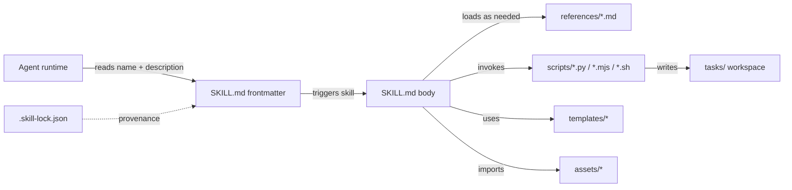

# Repository Guidelines

This repository hosts a curated collection of **agent skills** — self-contained capability packages that extend an agent's workflows, tools, and reference material. Each skill lives in `skills/<skill-name>/` and is loaded by name.

---

## Project Overview

- **Purpose**: Distribute, version, and validate agent skills (prompt + script bundles) that downstream agents discover and invoke by `name`.
- **Domain**: OpenCowork / Claude-style agent platform. Skills are referenced from the frontmatter `name` field at runtime; only `SKILL.md` is loaded by default, with subdirectory content loaded on demand.
- **Scale**: 72 skills under `skills/` as of last inventory (`ls -d skills/*/`).
- **Source mix**: Skills are authored both locally and pulled from upstream repos (e.g. `tavily-ai/skills`, `vercel-labs/skills`, `jimliu/baoyu-skills`); see `.skill-lock.json` for tracked installations.

## Architecture & Data Flow



**Loading levels (progressive disclosure)**:

1. **Metadata** — `name` + `description` from frontmatter (always in context, ~100 words).
2. **Body** — `SKILL.md` markdown, loaded when the skill triggers (<5k words / <500 lines budget).
3. **Bundled resources** — `references/`, `scripts/`, `templates/`, `assets/` — loaded only as needed.

**Registry**: `.skill-lock.json` maps skill name → upstream source URL, installed timestamp, and `skillPath`. It is auto-generated; never hand-edit.

## Key Directories

| Path | Purpose |
|---|---|
| `skills/<name>/SKILL.md` | Required entry. YAML frontmatter + markdown body. The single file the runtime reads first. |
| `skills/<name>/references/` | Long-form docs loaded on demand (specs, schemas, API docs). Keep one level deep from `SKILL.md`. |
| `skills/<name>/scripts/` | Executable helpers — mostly Python (`.py`), some Node (`.mjs`/`.js`), some shell (`.sh`/`.ps1`). |
| `skills/<name>/templates/` | Output templates (YAML workflows, Markdown scaffolds) that the skill fills in. |
| `skills/<name>/workflows/` | Multi-step procedure docs (Markdown) guiding the agent through complex tasks. |
| `skills/<name>/assets/` | Files copied into output (boilerplate projects, images, icons). Not loaded into context. |
| `skills/<name>/agents/` | Rare. Sub-agent definitions (e.g. `product-design/agents/openai.yaml`). |
| `.skill-lock.json` | Tool-managed registry. Maps skill → source repo + install timestamp. |
| `tasks/` | Throwaway working directory for agent runs. Do **not** commit generated artifacts here. |
| `.bitfun/` | Local-only IDE cache; ignored by `.gitignore`. |

**Subdir usage (current inventory)**: `references/` 17 skills · `scripts/` 22 · `templates/` 5 · `workflows/` 3 · `assets/` 1 (`sap-extension-creator`) · `agents/` 1 (`product-design`).

**Important subdir rule** — `skills/product-design/templates/prototype/AGENTS.md` mandates that prototype work must self-serve the dev server (run it, open it in the OpenCowork browser) instead of instructing the user to do so.

## Development Commands

The canonical validation/distribution surface for this repo:

```bash
npx -y skills-ref validate <path>   # Validate SKILL.md frontmatter + required sections + word budgets
npx -y skills-ref build <path>      # Package a skill into a distributable artifact
npx -y skills-ref list              # List all skills and their lock state
```

Target a single skill (`skills/foo`) or the whole tree (`skills`). There is no project-wide build/test runner — `SKILL.md` is consumed as-is at runtime.

Per-skill scaffolding/validation scripts (run from any cwd):

```bash
# Create a new skill skeleton
python3 skills/skill-creator/scripts/init_skill.py <name> --path <out-dir>

# Package a skill (runs validation, then zips to .skill file)
python3 skills/skill-creator/scripts/package_skill.py <skill-dir>

# Validate frontmatter only (fast)
python3 skills/skill-creator/scripts/quick_validate.py <skill-dir>
```

Specific bundled scripts worth knowing:

```bash
python3 skills/create-extension/scripts/create_extension.py <id> --path <dir> --template {minimal|http|ui} [--validate-only]
node skills/product-design/scripts/bootstrap-prototype.mjs --dest <abs-path>
python3 skills/product-design/scripts/user_context_preflight.py
```

## Code Conventions & Common Patterns

### SKILL.md frontmatter (mandatory schema)

- **`name`** — required. Lowercase, hyphen-separated. Must match directory name. Pattern: `^[a-z0-9-]+$`, ≤64 chars. See `skills/skill-creator/scripts/quick_validate.py`.
- **`description`** — required. Single sentence stating both *what* the skill does and *when* to use it (the runtime uses this to decide whether to trigger). ≤1024 chars, no angle brackets.
- **Optional**: `license`, `compatibility`, `allowed-tools`, `metadata`, `version`, `slug`, `homepage`, `changelog`, `authors`, `credentials`, `tags`.

**Standard schema** (per `skills/skill-creator/SKILL.md`):

```yaml
---
name: my-skill
description: Does X. Use when the user asks for Y or mentions Z.
---
```

### SKILL.md body structure

- `# Skill Name` heading.
- `## When to use this skill` or `## Workflow` section near the top.
- Imperative-voice sections describing capability/workflow.
- Keep body **under 500 lines** (`skills/skill-creator/SKILL.md:124`). Move detail into `references/`.
- Avoid `README.md`, `INSTALLATION.md`, `CHANGELOG.md`, etc. inside skills — only files that directly support the agent's job belong there (`skills/skill-creator/SKILL.md:102-112`).
- Reference other files with relative paths from `SKILL.md`, e.g. `references/extension-v1.md`.

### Naming & structure

- **Skill names**: lowercase, hyphen-separated (`csv-pipeline`, `find-skills`). A few legacy dirs embed version suffixes (`elite-tools-0.0.1`, `self-improving-1.2.10`, `summarize-1.0.0`) — don't copy this pattern.
- **Script entrypoints**: prefer `scripts/<verb>_<noun>.py` (e.g. `init_skill.py`, `create_extension.py`, `fill_fillable_fields.py`).
- **Reference files**: descriptive snake/kebab-case names matching the topic (`extension-v1.md`, `audit.md`, `get-context.md`).

### Formatting

- **Markdown**: 2-space indent.
- **Python**: 4-space indent, PEP 8.
- **JSON / YAML**: 2-space indent.
- **Script comments**: only for non-obvious intent, invariants, or edge cases — don't restate the code.

### Scripts — common patterns

- **No package manifest** at repo root. No `pyproject.toml`, `requirements.txt`, `setup.py`, or `Pipfile` anywhere — scripts are run directly with `python3 <script>.py` and assume a global Python environment.
- **Python**: Standard library + ad-hoc imports. Many scripts bundle their own helpers (e.g. `pdf/scripts/fill_fillable_fields.py`).
- **Node**: ESM (`.mjs`) where present; consumed directly with `node <script>.mjs`.
- **Shell wrappers**: paired `.sh` + `.ps1` for cross-platform helpers (e.g. `anysearch-skill/scripts/`, `planning-with-files-master/scripts/`).
- **Tool invocation pattern**: scripts reference the skill's own directory via `{skill_root}` placeholder in `SKILL.md` examples, e.g. `python3 {skill_root}/scripts/create_extension.py`.
- **CLI flags**: `--path`, `--template`, `--validate-only`, `--force`. Validate-only flags are used as a smoke test before handoff.
- **No shared library**: there's no internal Python package reused across skills; each skill stands alone.

### Workflow YAML (`skills/create-workflow/templates/workflow-definition.yaml`)

Versioned schema (`version: 1`) with these fields:

- Top-level: `version`, `name`, `description`, `params` (key/default map with `{{param}}` interpolation).
- Step (`steps[]`): `id`, `name`, `prompt`, `requires[]`, `produces[]`, `context_from[]`.
- `verify`: `{policy, minSize, pattern, command, prompt}` — policies are `content-heuristic`, `shell-command`, `prompt-verify`, or `human-review`.
- `iterate`: `{source, pattern}` — fan out over a file list using a regex.

### Templates & workflows

- `templates/` holds output scaffolds the agent fills in (YAML workflow defs, Markdown routers).
- `workflows/` holds step-by-step procedure docs in Markdown form.

## Important Files

| Path | Why it matters |
|---|---|
| `AGENTS.md` | This file. Read first. |
| `.skill-lock.json` | Provenance registry — auto-managed. |
| `skills/skill-creator/SKILL.md` | Authoritative guide to writing skills (schema, anatomy, progressive disclosure, 6-step creation process). Read before adding a skill. |
| `skills/skill-creator/scripts/quick_validate.py` | Concrete implementation of the frontmatter schema rules. |
| `skills/create-extension/references/extension-v1.md` | Spec for OpenCowork extension manifest. Read before modifying `create-extension`. |
| `skills/create-workflow/templates/workflow-definition.yaml` | Canonical workflow YAML schema (version 1). Read before adding a workflow template. |
| `skills/product-design/templates/prototype/AGENTS.md` | Local override rules for prototype work (self-serve dev server, treat visual target as source of truth). |
| `skills/*/SKILL.md` | One per skill. The agent only reads this by default. |

## Runtime / Tooling Preferences

- **Python** for most bundled scripts. Run with `python3 <script>.py`; no virtualenv or lockfile required at the repo level.
- **Node (ESM)** for prototype scaffolding (`bootstrap-prototype.mjs`) and a few other helpers. Run with `node <script>.mjs`.
- **Shell** wrappers in `.sh` (Unix) and `.ps1` (Windows) come paired for cross-platform skills.
- **Package manager**: `npm` (via `npx`) for the `skills-ref` CLI. There is no repo-level `package.json`.
- **No build step**: skills are consumed as-is. Only validation via `skills-ref validate` runs in CI-like checks.
- **No test framework**: verification is manual smoke test (call the skill, observe output) or the skill's own `--validate-only` / `quick_validate.py` paths.
- **No linter / formatter config** at repo level. Per-skill scripts may carry their own style, but the schema governs `SKILL.md` only.

## Testing & QA

This repo does **not** ship an automated test suite. Quality is enforced through:

1. **Schema validation**:
   ```bash
   npx -y skills-ref validate skills/<name>
   npx -y skills-ref validate skills   # whole tree
   python3 skills/skill-creator/scripts/quick_validate.py skills/<name>
   ```

2. **Script smoke tests**: each skill that bundles CLI helpers documents a one-liner verify command in its `SKILL.md` (e.g. `python3 scripts/extract.py --help`). The contributor guide requires this when the skill wraps a CLI or library.

3. **Manual verification** by invoking the skill from an agent and confirming the output matches intent. Single representative sample is acceptable when many similar scripts exist (per `skills/skill-creator/SKILL.md:296`).

4. **Cross-skill invariants** to check before merging a PR:
   - Skill directory name matches `name` frontmatter field.
   - `description` is one sentence stating *what* + *when*.
   - `SKILL.md` body is under 500 lines; long content lives in `references/`.
   - No extraneous `README.md` / `CHANGELOG.md` inside skill directories.
   - Frontmatter passes `quick_validate.py` constraints.
   - `tasks/` contains no untracked artifacts staged for commit.

## Pull Request Conventions

- **Commit messages**: imperative subject ≤72 chars. Scope by skill: `skills/csv-pipeline: add JSON output mode`.
- **One PR per skill** unless changes are tightly coupled.
- **PR description**: list affected skills, user-facing changes, and the validation commands run. Paste the `skills-ref validate` output for each affected path.
- **Never commit** generated `tasks/` artifacts or local edit history. `.skill-lock.json` updates from tooling are fine to commit.
- **When in doubt about a skill's design**: read `skills/skill-creator/SKILL.md` end-to-end first.