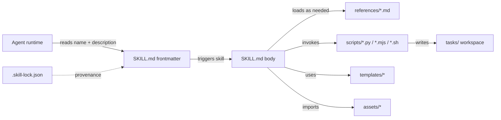

# .agents

一个**用户级通用技能（Skill）集合仓库**——任何遵循 [Agent Skills 开源标准](https://agentskills.io)的智能体框架与客户端都能直接消费。

本仓库汇集了一组自包含的技能包：每个技能都是一份「领域入职指南」——把通用智能体变成具备专业工作流、工具集成和参考资料的专业化智能体。技能清单见 `skills/`，会持续新增。

> **远程仓库**：`git@github.com:pelioo/.agents.git`（默认分支 `main`）
> **协作规则**：见 [`AGENTS.md`](./AGENTS.md)；技能开发前必读 `skills/skill-creator/SKILL.md`。

---

## 目录

- [项目概览](#项目概览)
- [仓库结构](#仓库结构)
- [技能目录一览](#技能目录一览)
- [安装与验证](#安装与验证)
- [编写一个新技能](#编写一个新技能)
- [技能 Schema 与约定](#技能-schema-与约定)
- [贡献与 PR 流程](#贡献与-pr-流程)
- [许可与来源](#许可与来源)

---

## 项目概览

| 维度 | 说明 |
| **定位** | 用户级通用智能体技能库（prompt + 脚本），按 `name` 加载 |
| **适用客户端** | 任何遵循 [Agent Skills 开源标准](https://agentskills.io) 的智能体框架 / 客户端；`.skill-lock.json` 的 `lastSelectedAgents` 记录了已实测加载过本仓库的智能体（如 Claude Code、Cursor、Cline、Codex、Gemini CLI、GitHub Copilot、Kimi CLI、opencode），清单仅供参考、非准入限制 |
| **加载方式** | 仅在触发时加载 `SKILL.md` 主体；`references/`、`scripts/` 等按需加载 |
| **来源** | 本地自研 + 同步自上游社区（`tavily-ai/skills`、`vercel-labs/skills`、`jimliu/baoyu-skills`、`vikiboss/60s-skills` 等），由 `.skill-lock.json` 追踪 |

### 数据流概览



### 三级渐进式加载

1. **元数据层** —— `name` + `description`（始终在上下文中，约 100 词）。
2. **主体层** —— `SKILL.md` Markdown 主体（仅在技能被触发时加载，预算 < 5k 词 / < 500 行）。
3. **资源层** —— `references/`、`scripts/`、`templates/`、`assets/`，按需加载；脚本可不读入上下文直接执行。

---

## 仓库结构

```
.
├── AGENTS.md                 仓库协作与开发规范（必读）
├── README.md                 本文件
├── .gitignore                忽略 .bitfun/search/flashgrep-index/
├── .skill-lock.json          技能来源与安装时间的自动登记
├── skills/                   各技能的根目录（按主题分类，见下节）
│   └── <skill-name>/
│       ├── SKILL.md          必填：YAML frontmatter + Markdown 主体
│       ├── references/       可选：长篇参考文档（按需加载）
│       ├── scripts/          可选：可执行脚本（Python / Node / Shell）
│       ├── templates/        可选：输出模板（YAML / Markdown 脚手架）
│       ├── workflows/        可选：多步骤流程文档
│       ├── assets/           可选：随输出分发的静态资源
│       └── agents/           罕见：子智能体定义
├── tasks/                    智能体运行时的临时工作区（不要提交产物）
└── .bitfun/                  IDE 本地缓存（已被 .gitignore 忽略）
```

> **强约定**：`tasks/` 目录仅用于智能体运行时的临时产物，**禁止** 把生成物提交到 Git。`.bitfun/` 由 IDE 维护，已被忽略。

### 子目录使用统计

| 子目录 | 涉及的技能数 |
| --- | --- |
| `references/` | 17 |
| `scripts/` | 22 |
| `templates/` | 5 |
| `workflows/` | 3 |
| `assets/` | 1（`sap-extension-creator`） |
| `agents/` | 1（`product-design`） |

---

## 技能目录一览

按主题归类的技能（节选，完整列表见 `ls -d skills/*/`，会随提交持续增加）：

### 🏗️ 技能创建与扩展

- `skill-creator` —— 编写技能的权威指南（读这一份就够）
- `create-skill` —— GSD 风格技能的专家级创建与精修指南
- `create-workflow` —— 创建版本化的工作流 YAML
- `create-extension` —— 创建 OpenCowork 扩展（v1 清单，**面向特定平台的子集**）
- `create-mcp-server` —— 构 Model Context Protocol 服务
- `create-gsd-extension` —— 编写 GSD 扩展模块
- `spike-wrap-up` —— 把 spike 结论沉淀为本地技能

### 🧑‍💻 开发工作流

- `code` —— 干净软件开发流程（规划、实现、验证、测试）
- `code-optimizer` —— 全维度代码性能审查
- `tdd` —— 测试驱动开发
- `test` —— 自动检测测试框架并生成/运行测试
- `lint` —— 自动检测 ESLint / Biome / Prettier 并自动修复
- `debug-like-expert` —— 复杂问题的根因调查协议
- `systematic-debugging`、`forensics`、`review`、`code-review-and-quality`
- `dependency-upgrade` —— 安全的依赖升级编排
- `decompose-into-slices` —— 把规划拆成可独立抓取的纵向切片
- `grill-me` —— 压力测试设计决策
- `handoff` —— 跨会话交接
- `verify-before-complete` —— 完成前的证据校验
- `writing-plans`、`planning-with-files-master`

### 🎨 前端与设计

- `frontend-design`、`frontend-skill`、`frontend-ui-engineering`
- `product-design` —— 产品设计全流程（附带 Vite 原型模板）
- `web-design-guidelines`、`web-quality-audit`
- `userinterface-wiki` —— 50+ 条 UI/UX 规则
- `accessibility` —— WCAG 2.1 可访问性审计
- `core-web-vitals` —— LCP / INP / CLS 优化
- `react-best-practices` —— Vercel 出品的 React/Next 性能规则
- `make-interfaces-feel-better`、`explain-code`、`web-scraper`

### 🔌 工具与集成

- `a2ui` —— A2UI v0.9 声明式 UI（原生 React Native 仪表盘）
- `create-extension`、`create-gsd-extension`、`create-mcp-server`
- `sap-extension-creator` —— Super Agent Party 扩展脚手架
- `playwright-dev` —— Playwright API / MCP / 供应商依赖
- `agent-browser` —— Chromium 浏览器自动化 CLI
- `browser-automation` —— CDP 网页自动化脚本
- `agent-reach` —— 17 个平台（社媒 / 搜索 / 视频）的 CLI + Python 工具
- `browser-testing-with-devtools` —— 真实浏览器调试
- `find-skills` —— 跨仓库发现并安装技能
- `search` —— Tavily 搜索 API
- `multi-search-engine` —— 17 个搜索引擎聚合
- `anysearch-skill` —— 实时搜索 + 23 域垂直搜索
- `summarize`、`explain-code`、`web-scraper`

### 📄 文档与办公

- `pdf`、`docx`、`xlsx`、`pptx`、`excel-processor`、`officeCLI`
- `image-ocr` —— 从图片提取文字
- `wechat-ui-sender` —— 桌面微信消息发送
- `post-to-x` —— X.com 推文发布
- `email-drafter` —— 商务邮件草稿生成
- `baoyu-translate` —— 文章 / 文档翻译（精翻 / 速翻 / 校对）
- `write-docs`、`write-milestone-brief`、`blog-author`
- `documentation-and-adrs`

### 🛡️ 质量与安全

- `security-review`、`security-and-hardening`、`best-practices`
- `code-review-and-quality`、`silent-failure-hunter`
- `observability` —— Agent-first 可观测性
- `github-workflows` —— GitHub Actions 工作流
- `ci-cd-and-automation`

### 🧠 智能体元技能

- `using-superpowers`、`using-agent-skills`、`find-skills`
- `brainstorming`、`idea-refine`、`subagent-driven-development`
- `dispatching-parallel-agents`、`executing-plans`
- `react-cognitive-loop`、`超能模式`
- `doubt-driven-development`、`karpathy-guidelines`
- `Self-Improving Agent` —— 自反思 / 自批评 / 自学习
- `btw` —— 不打断主线的快速旁问

### 🇨🇳 中文场景

- `weather-query` —— 中国各地实时天气
- `xiaohongshu-creator`、`xiaohongshu-search` —— 小红书内容生产与抓取

---

> **关于平台特定技能**：本仓库的绝大多数技能都是 [Agent Skills 开源标准](https://agentskills.io) 之上的纯 prompt + 脚本 + 资源组合，不绑定任何特定智能体；少数技能（如 `create-extension` 创建 OpenCowork 扩展、`create-gsd-extension` 创建 GSD 扩展）专门面向特定平台。这类技能会显式在 `description` 与 SKILL.md 主体中注明「OpenCowork / GSD」字样，请按需选用。
---

## 安装与验证

### 校验整个仓库

```bash
# 校验所有技能的 frontmatter + 必要章节 + 词数预算
npx -y skills-ref validate skills

# 列出所有技能及其 lock 状态
npx -y skills-ref list

# 打包某个技能为可分发产物
npx -y skills-ref build skills/<name>
```

### 校验单个技能

```bash
# 快速 frontmatter 校验（无需联网）
python3 skills/skill-creator/scripts/quick_validate.py skills/<name>

# 完整打包前验证（运行 lint + 结构检查）
python3 skills/skill-creator/scripts/package_skill.py skills/<name>
```

### 常用脚本入口

```bash
# 创建新技能骨架
python3 skills/skill-creator/scripts/init_skill.py <name> --path <out-dir>

# 创建 OpenCowork 扩展（minimal / http / ui 模板）
python3 skills/create-extension/scripts/create_extension.py <id> \
    --path <dir> --template {minimal|http|ui} [--validate-only]

# 引导产品设计原型（自托管 dev server）
node skills/product-design/scripts/bootstrap-prototype.mjs --dest <abs-path>
```

### 脚本运行约定

- **Python 脚本**直接 `python3 <script>.py` 运行；仓库根**没有** `pyproject.toml` / `requirements.txt`，假设全局 Python 环境可用。
- **Node 脚本**用 ESM（`.mjs`），`node <script>.mjs` 运行。
- **Shell 包装器**成对出现 `.sh` + `.ps1`（如 `anysearch-skill/scripts/`）。
- 技能 SKILL.md 中引用脚本时，使用 `{skill_root}` 占位符，例如 `python3 {skill_root}/scripts/foo.py`。

---

## 编写一个新技能

> 完整流程见 `skills/skill-creator/SKILL.md`；本节是精简版。

1. **理解具体用例** —— 至少举 3 个真实问题场景；问自己「什么时候用户会触发这个技能」。
2. **规划可复用资源** —— 哪些脚本、参考文档、模板会反复用到？把它们列出来。
3. **初始化骨架**：
   ```bash
   python3 skills/skill-creator/scripts/init_skill.py <name> --path <out-dir>
   ```
4. **实现内容** —— 先写 `scripts/`、`references/`、`assets/`，再写 `SKILL.md`。
5. **写 SKILL.md** —— frontmatter + 主体；主体保持 < 500 行。
6. **打包验证**：
   ```bash
   python3 skills/skill-creator/scripts/package_skill.py <out-dir>
   ```
7. **真实使用迭代** —— 跑一次，观察输出，调整。

### 触发条件设计

`description` 字段是智能体决定是否触发该技能**唯一**的依据，必须写成「做什么 + 何时使用」的单句。例：

> 翻译文章与文档（快翻 / 精翻 / 校对三种模式），支持术语表与本地化。

≤ 1024 字符；不包含尖括号；用第三人称。

---

## 技能 Schema 与约定

### Frontmatter 强制字段

```yaml
---
name: my-skill              # 必填：小写连字符，与目录同名，正则 ^[a-z0-9-]+$，≤ 64 字符
description: Does X. Use when user asks for Y or mentions Z.   # 必填：单句，≤ 1024 字符
---
```

### 可选字段

`license` / `compatibility` / `allowed-tools` / `metadata` / `version` / `slug` / `homepage` / `changelog` / `authors` / `credentials` / `tags`。

### 主体结构建议

- `# Skill Name` 标题。
- 顶部要有 `## When to use this skill` 或 `## Workflow`。
- 命令式语气；说明能力 / 流程。
- **< 500 行**；细节外移到 `references/`。
- **不要**在技能目录内创建 `README.md` / `CHANGELOG.md` / `INSTALLATION.md` 等冗余文档。

### 命名

- 技能名：小写连字符（`csv-pipeline`、`find-skills`）。
- 脚本入口：`scripts/<verb>_<noun>.py`（如 `init_skill.py`、`create_extension.py`）。
- 参考文件：与主题对应的 snake / kebab-case 名（如 `extension-v1.md`、`audit.md`）。

### 缩进

- Markdown：2 空格。
- Python：4 空格（PEP 8）。
- JSON / YAML：2 空格。

### 跨技能不变式（合并前自检）

- [ ] 目录名与 `name` frontmatter 一致。
- [ ] `description` 是「what + when」的单句。
- [ ] `SKILL.md` 主体 < 500 行。
- [ ] 技能目录内**没有** `README.md` / `CHANGELOG.md`。
- [ ] Frontmatter 通过 `quick_validate.py` 校验。
- [ ] `tasks/` 目录没有未追踪的产物。
- [ ] 本地跑过 `npx -y skills-ref validate skills/<name>`。

---

## 贡献与 PR 流程

### 提交信息

- 祈使语气，主题 ≤ 72 字符。
- 用技能名作 scope：`skills/csv-pipeline: add JSON output mode`。

### PR 原则

- **一个技能一个 PR**（除非改动紧密耦合）。
- PR 描述必须列出：
  - 影响的技能；
  - 用户可感知的变化；
  - 跑过的校验命令与输出（特别是 `npx skills-ref validate`）。

### 不要提交

- `tasks/` 中的生成物或本地编辑历史。
- 手改 `.skill-lock.json`（由工具维护）。
- 任何带 "TODO: implement" 的占位符 / mock / 桩。

### 提交前

1. 读 `skills/skill-creator/SKILL.md` 全文（如果对设计有疑问）。
2. 跑本技能 + 整个仓库的校验。
3. 在 PR 中粘贴两份 `skills-ref validate` 输出。

---

## 许可与来源

仓库内各技能保留各自上游仓库的许可证；详情见各技能 `SKILL.md` 的 `license` 字段。

### 同步来源

由 `.skill-lock.json` 追踪：

| 技能 | 上游仓库 |
| --- | --- |
| `search` | [`tavily-ai/skills`](https://github.com/tavily-ai/skills) |
| `find-skills` | [`vercel-labs/skills`](https://github.com/vercel-labs/skills) |
| `weather-query` | [`vikiboss/60s-skills`](https://github.com/vikiboss/60s-skills) |
| `baoyu-translate` | [`jimliu/baoyu-skills`](https://github.com/jimliu/baoyu-skills) |

其余技能为本仓库自研或上游未声明追踪。

---

## 维护者速查

| 想做的事 | 入口 |
| --- | --- |
| 加一个新技能 | `skills/skill-creator/SKILL.md` → Step 1–6 |
| 改进某个技能 | 读 `skills/create-skill/SKILL.md` 的「Working with existing skills」 |
| 修改扩展清单 | `skills/create-extension/references/extension-v1.md` |
| 添加工作流模板 | `skills/create-workflow/templates/workflow-definition.yaml` |
| 改前端设计规则 | `skills/userinterface-wiki/rules/` |
| React/Next 性能规则 | `skills/react-best-practices/rules/` |
| 排查仓库协作问题 | `AGENTS.md` |

— Happy hacking.
